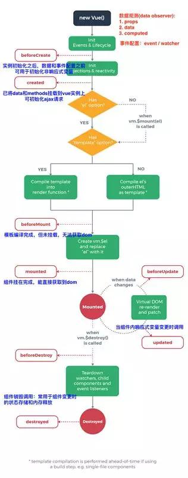

<!-- markdownlint-disable MD032 MD022-->
# vue基础教程

## 目录
- [:tada: 搭建一个vue项目](#:tada:搭建一个vue项目)

- [:star2: 分析src文件夹的逻辑关系](#:star2:分析src文件夹的逻辑关系)

  - index.html
  - vue入口文件 main.js
  - 父组件 App.vue
  - 子组件 components文件夹

- [:eyes: 处理逻辑：`<script>`详解](#:eyes:处理逻辑：`<script>`详解)

- [:relieved: 属性绑定和双向数据绑定](#:relieved:属性绑定和双向数据绑定)

  - 属性绑定`v-bind`
  - 双向绑定`v-model`

- [:relaxed: 计算属性与侦听器](#:relaxed:计算属性与侦听器)

  - 计算属性`computed: {},`
  - 侦听器`watch: {},`

- [:point_right: v-if指令](#:point_right:v-if指令)

- [:point_right: v-show指令](#:point_right:v-show指令)

- [:point_right: v-for指令](#:point_right:v-for指令)

- [:fire: v-on](#:fire:v-on)

- [:two_hearts: 父组件向子组件传递数据](#:two_hearts:父组件向子组件传递数据)

- [:revolving_hearts: 子组件向父组件传递数据](#:revolving_hearts:子组件向父组件传递数据)

- [:exclamation: 生命周期钩子函数](#:exclamation:生命周期钩子函数)

- [:speech_balloon: 简单的vue路由](#:speech_balloon:简单的vue路由)

## :tada: 搭建一个vue项目

- 打开命令行工具---运行：

``` {.line-numbers}
# 全局安装 vue-cli
$ npm install --global vue-cli

# 创建一个基于 webpack 模板的新项目
$ vue init webpack [name]

# 安装依赖，运行项目
$ cd [name]
$ npm run dev
```

- 安装过程中出现的命令行的意思：

  - 项目的名字是什么? [name]
  - 项目的描述?
  - 项目的作者?
  - 是否使用路由v-router? no
  - 是否使用ESLint语法校检? no
  - 是否安装测试单元“unit tests”? no
  - 是否安装测试单元“e2e tests”? no
  - 是否安装依赖? yes

## :star2: 分析src文件夹的逻辑关系

> index.html ---> main.js ---> App.vue ---> components

- index.html

```html
<div id="app"></div>
<!-- built files will be auto injected -->
```

- vue入口文件 main.js

```javascript
// 实例化vue对象
new Vue({
  // 绑定根标签
  el: '#app',
  // 注册组件
  components: { App }, //<---来源于 import 导入的App.vue
  // 模板
  template: '<App/>' // <---组件调用标签
})
// index.html ---> main.js ---> App.vue
```

- 父组件 App.vue

  1. 模板：html结构：`<template>中有且只能有一个根标签<div id="app">`
  2. 行为：处理逻辑：`<script>`
  3. 样式：解决样式：`<style>全局样式,<style scoped>子组件样式`

- 子组件 components文件夹---[Name]第一个字母大写

  - 全局组件---在main.js中注册组件

  ```javascript
  // 导入子组件
  import Users from './components/Users'

  // 注册全局组件
  Vue.component('users',Users)
  ```

  - 局部组件---在App.vue的`<script>`中注册组件

  ```javascript
  // 导入子组件
  import Users from './components/Users'
  import Header from './components/Header'
  import Footer from './components/Footer'

  // 注册局部组件
  components: {
    Users,  //--->属性和值一致可以只写一个
    "app-header": Header,  //--->避免和<header>标签重复
    "app-footer": Footer,  //--->避免和<footer>标签重复
  },
  // components 与name data 同级
  ```

  - 使用子组件

    使用注册时的组件名称`users,app-header,app-footer`作为标签名称`<users/>,<app-header/>,<app-footer/>`，子组件中`<template>`中的内容就能显示到父组件中。

  ```html
  <template>
  <!-- 有且只能有一个根标签 -->
  <div id="app">
    <app-header></app-header>
    <users></users>
    <app-footer></app-footer>
  </div>
  </template>
  ```

## :eyes: 处理逻辑：`<script>`详解

```javascript
<script>
// 导入子组件
import [Yyy] from './components/[Yyy]'

export default {
  name: '[Xxx]',  // 组件名称
  components: {}, // 注册局部组件
  data () {},     // 数据
  methods: {},    // 方法
  watch: {},      // 侦听器
  computed: {},   // 计算属性
  props: [],      // 接受父组件传递的数据
  `实例生命周期钩子函数`
}
</script>
```

## :relieved: 属性绑定和双向数据绑定

- 属性绑定`v-bind`

  在`<template>`下的标签中加入`v-bind:属性="属性值"`，可以简写为`:属性="属性值"`

  ```html
  <div :title="title">hello world</div>
  ```

- 双向绑定`v-model`

  在`<template>`下的标签中加入`v-model="属性值"`，一般与`<input/><select/><textarea/>`一起使用

  ```html
  <input v-model="content">
  ```

  *`属性值`的名称和`data数据`中的名称保持一致*

## :relaxed: 计算属性与侦听器

- 计算属性`computed: {},`

  ```html
  <p>Age + A = {{addToA}}</p>
  <p>Age + B = {{addToB}}</p>
  ```

  ```javascript
  computed: {
    addToA () {
      return this.a + this.age
    },
    addToB () {
      return this.b + this.age
  }
  ```

  我们可以将同一函数定义为一个方法而不是一个计算属性。两种方式的最终结果确实是完全相同的。然而，不同的是**计算属性是基于它们的依赖进行缓存的**。计算属性只有在它的相关依赖发生改变时才会重新求值。

  我们为什么需要缓存？假设我们有一个性能开销比较大的计算属性 A，它需要遍历一个巨大的数组并做大量的计算。然后我们可能有其他的计算属性依赖于 A 。如果没有缓存，我们将不可避免的多次执行 A 的 getter！如果你不希望有缓存，请用方法来替代。

- 侦听器`watch: {},`

  ```javascript
  watch: {
    // 一旦 firstName 和 lastName 的值发生改变，就执行函数
    firstName: function () {
      this.count++
    },
    lastName: function () {
      this.count++
    }
  }
  ```

  当需要在数据变化时执行异步或开销较大的操作时，这个方式是最有用的。

## :point_right: v-if指令

- v-if

  ```html
  <template v-if="ok">
    <h1>Title</h1>
    <p>Paragraph 1</p>
    <p>Paragraph 2</p>
  </template>
  ```

  *`v-if`的隐藏是 直接删除 DOM 元素*

- v-else

  ```html
  <div v-if="Math.random() > 0.5">
    Now you see me
  </div>
  <div v-else>
    Now you don't
  </div>
  ```

  *`v-else` 元素必须紧跟在带 `v-if` 或者 `v-else-if` 的元素的后面， 否则它将不会被识别。*

- v-else-if

  ```html
  <div v-if="type === 'A'">
    A
  </div>
  <div v-else-if="type === 'B'">
    B
  </div>
  <div v-else-if="type === 'C'">
    C
  /div>
  <div v-else>
    Not A/B/C
  </div>
  ```

  `v-else-if` 也必须紧跟在带 `v-if` 或者 `v-else-if` 的元素之后。

## :point_right: v-show指令

```html
<h1 v-show="ok">Hello!</h1>
```

不同的是带有 `v-show` 的元素始终会被渲染并保留在 DOM 中。`v-show` 只是简单地切换元素的 CSS 属性 `display`。
如果需要非常频繁地切换，则使用 `v-show` 较好

*注意，`v-show`不支持 `<template>` 元素，也不支持 `v-else`。*

## :point_right: v-for指令

- 遍历数组

  `v-for` 指令需要使用 `item in items` 形式的特殊语法，`items` 是源数据数组，并且 `item` 是数组元素迭代的别名。

  ```html
  <ul>
    <li v-for="characters in characters">{{characters}}</li>
  </ul>
  <ul>
    <li v-for="users in users">{{users.name}}-{{users.age}} </li>
  </ul>
  ```

  `v-for` 还支持一个可选的第二个参数为当前项的索引 `v-for="(item,   index) in items"`

  ```html
  <ul>
    <li v-for="(users,index) in users" :key="index">{{index}}.  {{users.name}}-{{users.age}}</li>
  </ul>
  ```

  你也可以用 of 替代 in 作为分隔符，因为它是最接近 JavaScript 迭代器  的语法：`<div v-for="item of items"></div>`

- 遍历对象

  `v-for="value in object"`

  ```html
  <ul>
    <li v-for="value in object">
      {{ value }}
    </li>
  </ul>
  ```

  `v-for` 还支持一个可选的第二个参数为键名 `v-for="(value, key) in object"`

  ```html
  <div v-for="(value, key) in object">
    {{ key }}: {{ value }}
  </div>
  ```

  第三个参数为索引：`(value, key, index) in object`

  ```html
  <div v-for="(value, key, index) in object">
  {{ index }}. {{ key }}: {{ value }}
  </div>
  ```

- `v-for` on a `<template>`

  ```html
  <!-- 生成三个 div>h3+p 形式的元素 -->
  <div v-for="(users,index) in users">
    <h3>{{index}}.{{users.name}}</h3>
    <p>Age-{{users.age}}</p>
  </div>

  <!-- v-for on a <template> -->
  <!-- 生成三个 h3+p 形式的元素 -->
  <template v-for="(users,index) in users">
    <h3>{{index}}.{{users.name}}</h3>
    <p>Age-{{users.age}}</p>
  </template>
  ```

  **如果在组件中使用 `v-for` 时，`key` 是必须的**

## :fire: v-on

可以用 `v-on` 指令监听 DOM 事件，并在触发时运行一些 JavaScript 代码。

在`<template>`下的标签中加入`v-on:监听事件="方法名"`，可以简写为`@监听事件="方法名"`

```javascript
<div>
  <!-- `greet` 是在methods中定义的方法名 -->
  <button v-on:click="greet">Greet</button>
</div>
```

- 事件修饰符

  - `.stop`
  - `.prevent`
  - `.capture`
  - `.self`
  - `.once`
  - `.passive`

  ```javascript
  <!-- 阻止单击事件继续传播 -->
  <a v-on:click.stop="doThis"></a>

  <!-- 提交事件不再重载页面 -->
  <form v-on:submit.prevent="onSubmit"></form>

  <!-- 修饰符可以串联 -->
  <a v-on:click.stop.prevent="doThat"></a>

  <!-- 只有修饰符 -->
  <form v-on:submit.prevent></form>

  <!-- 添加事件监听器时使用事件捕获模式 -->
  <!-- 即元素自身触发的事件先在此处处理，然后才交由内部元素进 行处理 -->
  <div v-on:click.capture="doThis">...</div>

  <!-- 只当在 event.target 是当前元素自身时触发处理函数   -->
  <!-- 即事件不是从内部元素触发的 -->
  <div v-on:click.self="doThat">...</div>

  <!-- 点击事件将只会触发一次 -->
  <a v-on:click.once="doThis"></a>

  <!-- 滚动事件的默认行为 (即滚动行为) 将会立即触发 -->
  <!-- 而不会等待 `onScroll` 完成  -->
  <!-- 这其中包含 `event.preventDefault()` 的情况 -->
  <div v-on:scroll.passive="onScroll">...</div>
  ```

  修饰符可以串联

  不要把 `.passive` 和 `.prevent` 一起使用，因为 `.prevent` 将会被忽略。

- 按键修饰符

  - `.enter`
  - `.tab`
  - `.delete` (捕获“删除”和“退格”键)
  - `.esc`
  - `.space`
  - `.up`
  - `.down`
  - `.left`
  - `.right`
  - 可以通过全局 `config.keyCodes` 对象自定义按键修饰符别名：

  ```javascript
  // 可以使用 `v-on:keyup.f1`
  Vue.config.keyCodes.f1 = 112
  ```

  - 你也可直接将 KeyboardEvent.key 暴露的任意有效按键名转换为 kebab-case 来作为修饰符：

  ```javascript
  <input @keyup.page-down="onPageDown">
  // 处理函数仅在 $event.key === 'PageDown' 时被调用
  ```

- 系统修饰键

  - `.ctrl`
  - `.alt`
  - `.shift`
  - `.meta`

  ```javascript
  <!-- Alt + C -->
  <input @keyup.alt.67="clear">

  <!-- Ctrl + Click -->
  <div @click.ctrl="doSomething">Do something</div>
  ```

  只有在按住 `ctrl` 的情况下释放其它按键，才能触发 `keyup.ctrl`。而单单释放 `ctrl` 也不会触发事件。

  如果你想要这样的行为，请为 `ctrl` 换用 `keyCode`：`keyup.17`。

  - `.exact`

    `.exact` 修饰符允许你控制由精确的系统修饰符组合触发的事件。

  ```javascript
  <!-- 即使 Alt 或 Shift 被一同按下时也会触发 -->
  <button @click.ctrl="onClick">A</button>

  <!-- 有且只有 Ctrl 被按下的时候才触发 -->
  <button @click.ctrl.exact="onCtrlClick">A</button>

  <!-- 没有任何系统修饰符被按下的时候才触发 -->
  <button @click.exact="onClick">A</button>
  ```

- 鼠标按钮修饰符
  - `.left`
  - `.right`
  - `.middle`

## :two_hearts: 父组件向子组件传递数据

在子组件的标签中绑定一个自定义属性，传入数据名字：

```html
<users :users="users"></users>
<users :users="users"></users>
<app-footer :title="title"></app-footer>
```

子组件接受数据：

```javascript
<script>
export default {
  ...
  // 接受父组件传递的数据 props:["自定义属性名"]
  props: ["users"],

  // props的标准写法：
  props: {
    users: {
      type: [数据类型],
      required: true,
    }
  },
  ...
</script>
```

父组件传递数据给子组件：

1. 传值：`string` `number` `boolean`  --->在子组件中修改该数据，仅当前组件发生修改
2. 传引用：`array` `object`    --->在子组件中修改该数据，所有引用位置都改变

根据需求来定传值还是传引用

## :revolving_hearts: 子组件向父组件传递数据

```javascript
<script>
  export default {
  ...
  methods: {
    changeTitle () {
      // 子组件向父组件传值$emit("传值名字","内容")
      this.$emit("titleChanged","子组件向父组件传值")
    },
  },
  ...
</script>
```

父组件接受数据：

```html
 <!-- 在子组件对应的标签中 绑定$emit("传值名字","内容")为传值名字的属性 获取内容用$event -->
  <app-header :title="title" @titleChanged="updateTitle($event)"></app-header>
```

```javascript
<script>
  export default {
  ...
  methods: {
    updateTitle (title) {
      this.title = title;
    },
  },
  ...
</script>
```

## :exclamation: 生命周期钩子函数



|生命周期钩子|组件状态|最佳实践|
|---|---|---|---|
| beforeCreate|实例初始化之后，this指向创建的实例，不能访问到data、computed、watch、methods上的方法和数据|常用于初始化非响应式变量|
|created|实例创建完成，可访问data、computed、watch、methods上的方法和数据，未挂载到DOM，不能访问到$el属性，$ref属性内容为空数组|常用于简单的ajax请求，页面的初始化|
|beforeMount|在挂载开始之前被调用，beforeMount之前，会找到对应的template，并编译成render函数||
|mounted|实例挂载到DOM上，此时可以通过DOM API获取到 DOM 节点，$ref属性可以访问|常用于获取VNode信息和操作，ajax请求|
|beforeUpdate|响应式数据更新时调用，发生在虚拟DOM打补丁之前|适合在更新之前访问现有的DOM，比如手动移除已添加的事件监听器|
|updated|虚拟 DOM 重新渲染和打补丁之后调用，组件DOM已经更新，可执行依赖于DOM的操作|避免在这个钩子函数中操作数据，可能陷入死循环|
|beforeDestroy|实例销毁之前调用。这一步，实例仍然完全可用，this仍能获取到实例|常用于销毁定时器、解绑全局事件、销毁插件对象等操作|
|destroyed|实例销毁后调用，调用后，Vue 实例指示的所有东西都会解绑定，所有的事件监听器会被移除，所有的子实例也会被销毁||

注意：

- `created`阶段的 ajax 请求与`mounted`请求的区别：前者页面视图未出现，如果请求信息过多，页面会长时间处于白屏状态
- `mounted` 不会承诺所有的子组件也都一起被挂载。如果你希望等到整个视图都渲染完毕，可以用 `vm.$nextTick`
- vue2.0之后主动调用`$destroy()`不会移除dom节点，作者不推荐直接destroy这种做法，如果实在需要这样用可以在这个生命周期钩子中手动移除dom节点

## :speech_balloon: 简单的vue路由

可以在项目开始搭建的时候选择使用路由，也可以自己加载路由

打开命令行工具---运行：

``` {.line-numbers}
# 安装 vue-router
$ npm install vue-router -D
```

在main.js中导入并配置路由

```javascript
// 导入路由
import VueRouter from 'vue-router'

// 调用路由
Vue.use(VueRouter);

// 配置路由
const router = new VueRouter({
  routes: [
    // 每个路由应该映射一个组件。 其中"component"是组件名字
    {path:"/",component:Home},
    {path:"/helloworld",component:HelloWorld},
  ],
  // 消除地址中的#
  mode: "history"
});

// 在实例对象中使用路由
new Vue({
  // 使用路由
  router,

  ...
});
```

使用路由渲染页面

```html
<template>
  <div id="app">
    <ul>
      <!-- 使用 router-link 组件来导航 -->
      <!-- 通过传入 `to` 属性指定链接 -->
      <!-- <router-link> 默认会被渲染成一个 `<a>` 标签 -->
      <!--使用路由 router-link to="和路由的path内容一致" -->
      <li><router-link to="/">Home</router-link></li>
      <li><router-link to="helloworld">Hello</router-link></li>
    </ul>

    <!-- 路由出口 -->
    <!-- 路由匹配到的组件将渲染在这里 -->
    <router-view></router-view>
  </div>
</template>
```